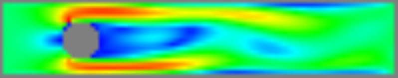

# stroemung

[](https://crates.io/crates/stroemung)
[](https://github.com/wickedchicken/stroemung/actions)
[](https://wickedchicken.github.io/post/hire-me/)



A Computational Fluid Dynamics (CFD) simulator in Rust.

## Intro

`stroemung` implements a 2D fluid dynamics simulation based on
[_Numerical Simulation in Fluid Dynamics: A Practical Introduction_][book] by
M. Griebel, T. Dornseifer, and T. Neunhoeffer, as well as [`NaSt2D`][nast2d], its associated
C implementation.

`stroemung` is also inspired by
[khanhn201/flow2d-rs](https://github.com/khanhn201/flow2d-rs) by
[**@khanhn201**](https://github.com/khanhn201).

Some project goals of `stroemung` are:

* Physically accurate simulation of the simplified fluid dynamics problems presented in
  _Numerical Simulation in Fluid Dynamics_.
* Reliance on `ndarray`'s higher-order iterators instead of indexing, where possible.
* Avoidance of branching code in inner loops, where possible.
* Integration and unit testing of linear algebra primitives, boundary condition setup
  routines, pressure solver and overall simulation steps [still in progress].
* Numerical comparison against the reference `NaSt2D` where appropriate.


## Name

_Die Strömungsmechanik, Fluidmechanik oder Strömungslehre ist die Wissenschaft vom
physikalischen Verhalten von Fluiden._ -- Wikipedia

## Status

* Currently shows a basic GUI with a simulation grid preset based on flow past an
  obstacle.
* The linear algebra primitives and some of the simulation steps have been implemented
  and tested against reference values from NaSt2d.
* The other parts of the implementation have been written, but not completely tested.
* Some methods are documented, most are not.
* The Python scripts to generate `NaSt2D` problem files and parse their outputs are
  partially implemented.

## Installation

### Cargo

* Install the rust toolchain in order to have cargo installed by following
  [this](https://www.rust-lang.org/tools/install) guide.

## Running

It is highly recommended to run in release mode, since the simulation can be
computationally demanding.

```sh
cargo run --release
```

Click "Run / Pause" to start the simulation, or "Run one simulation step" to iterate one
step.

You can draw boundary or fluid cells with the mouse by clicking on the
appropriate buttons. Note that the simulation doesn't allow for boundary
cells that have fluid on opposite sides. If you attempt to paint fluid
cells that create such a boundary, the drawing tool will simply reject
it. If you create a weird boundary pattern that you can't delete, just
paint over it with boundary cells again or reset the simulation.

Some simulation parameters can be adjusted from the command-line, see

```sh
cargo run --release -- --help
```

for details. For example, to increase the Reynolds number of the simulated fluid to
400, run:

```sh
cargo run --release -- --reynolds 400
```

## Generating test data

There is a Python script in the [`python/`](python/) directory which will generate
test data from the [`NaSt2D`][nast2d] program. See [`python/README.md`](python/README.md)
for more details.

## License

Licensed under the [MIT license](LICENSE).

## Contribution

Unless you explicitly state otherwise, any contribution intentionally submitted
for inclusion in the work by you, as defined in the MIT license, shall be
licensed as above, without any additional terms or conditions.

See [CONTRIBUTING.md](CONTRIBUTING.md).

[nast2d]: https://ins.uni-bonn.de/content/software-nast2d
[book]: https://epubs.siam.org/doi/10.1137/1.9780898719703
